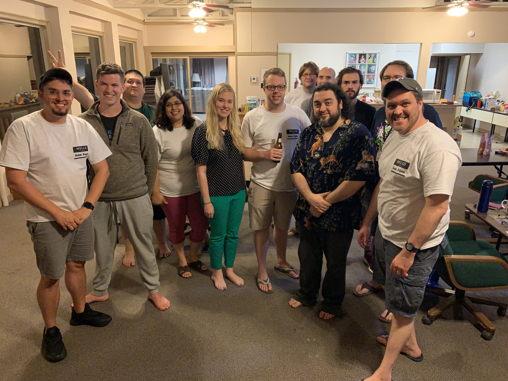

# DDC 2019
test

Ding Dong Con 2019 was held in Little Rock, AR this year.  Last year it was at my house and it was time for a change of pace.  We had people come from Kansas City, MO, Birmingham, AL, and Dallas, TX.  The drive was a little over 6 hours for all of us.  The place we stayed was called Ferncliff Camp and Conference Center.  The space was a bit older, but for the most part suited our needs.  The privacy of the rooms and the convenience of how close the gaming space was to our rooms was amazing.  However, the showers were extremely small and some of the rooms smelled like mildew.  I believe that was due to the dehumidifiers not bering ran before we arrived.

There were other activities that could have been done on the grounds such as hiking, canoeing, gaga ball, fishing, sand volleyball, basketball, and more.  Some of our group took part in the canoeing.

!!!info insert pictures of people canoeing here

Even though the space was older and out of date, I believe everyone had a good time and potentially would come back.

## Day 1 Games Played

### Tichu

The first game that was played at Ding Dong Con 2019 was a game of Tichu, played by myself, Brendon, Aaron, and Melissa.

### Pipeline

### Too Many Bones

## Day 2 Games Played

### The Game: Face to Face

### Kashgar: Merchants of the Silk Road

### Hail Hydra

### High Society (x2)

### Celestia

### Condotierre (x2)

### Camel Up

### Starfinder

### Too Many Bones

## Day 3 Games Played

### Xia: Legends of a Drift System

### Illusion

### Capital Lux

### Zombicide: Invader

### Quest for El Dorado

### Two Rooms and a Boom

### Monikers

### Secret Hitler

## Day 4 Games Played

### Champions of Midgard

### Caverna

### Xia: Legends of a Drift System
